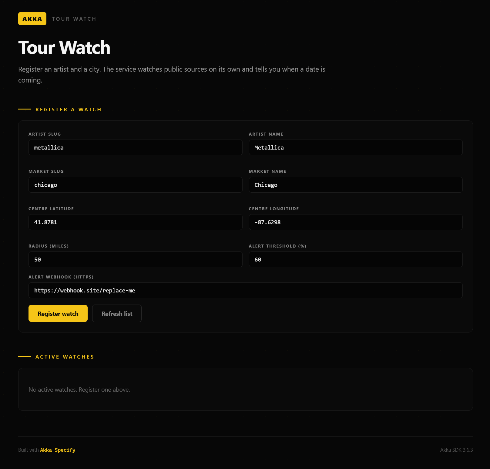
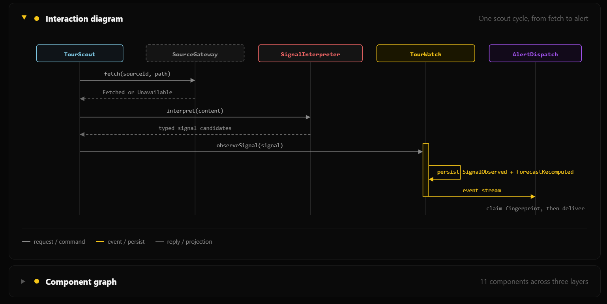

# Tour Watch

Register an artist and a city. The service watches public sources on its own and tells you when a date is coming.

Built with **Akka Specify**.



---

## Where it came from

The  application — specification, plan, task breakdown, implementation, tests, and documentation — was generated from this  prompt:

> Saurabh at Ascension is a huge fan of Metallica -- he would really like to know when they are coming to Chicago. Can you design an agentic AI system that can predict when they will arrive and how he can get free tickets for that. Come up with a proposal and a plan.

---

## What it does

From the specification:

- **Know before the world knows.** A watch observes public touring signals unattended and maintains a likelihood that the artist will play the market, together with the window in which an announcement is expected. When a date is officially announced, an alert goes out within 15 minutes, carrying the venue, the dates, the on-sale time, and how long is left to act.
- **Free ways in.** Legitimate no-cost routes to a confirmed date — station contests, fan-club draws, venue and sponsor giveaways — are tracked with their eligibility rules and closing deadlines, with a reminder before each one closes.
- **Show me why.** Every forecast can be opened down to the signals behind it, each with a public source and the time it was observed. A signal you know is wrong can be dismissed, and the estimate recomputes without it.
- **Keep itself honest.** Forecasts are resolved against what actually happened, and the system reports its own hit rate by confidence band.



Generated documentation lives at [`docs/index.html`](docs/index.html) — open it in a browser.

---

## Running it — the short path

You do not need Java, Maven, or the Akka CLI installed. Akka Specify installs them for you.

**1. Install Akka Specify** in Claude Code:

```
/plugin marketplace add akka/ai-marketplace
/plugin install akka@akka-ai-marketplace
```

Restart Claude Code when it asks.

**2. Give it this prompt:**

> Clone https://github.com/TylerJewell/ascension into a new directory and open it.
> Then run /akka:setup to install everything this project needs, and /akka:build to
> compile it, run the tests, and start it locally.

**3. Open the console** at http://localhost:9008.

Akka Specify installs the toolchain, provisions the Akka download token, builds the project, runs the tests, and starts the service. Set a model key first — see [Model providers](#model-providers) below — or the service will start but any step that calls an agent will fail.

---

## Running it — the developer path

### Requirements

- Java 21 or newer
- Maven 3.9 or newer
- An Akka download token — run `akka code token` once
- A key for one of the [supported model providers](#model-providers)

### 1. Set the model key

The project defaults to Google AI Gemini. Put your key in the environment:

```bash
read -rs GOOGLE_AI_GEMINI_API_KEY && export GOOGLE_AI_GEMINI_API_KEY
```

To use a different provider, see [Model providers](#model-providers).

### 2. Start the service

```bash
mvn compile
akka local run
```

The service starts on **port 9008**.

### 3. Open the console

```
http://localhost:9008
```

Register a watch using the form. Defaults are filled in for Metallica in Chicago. Set the alert webhook to a URL you control — [webhook.site](https://webhook.site) works for a trial.

### 4. Add a source to watch

The service ships with no sources configured, so it will not reach out to anything until you add one. Open `src/main/resources/sources.conf` and add an entry:

```hocon
tourwatch.sources = [
  {
    source-id     = "official-events"
    host          = "events.example.com"
    tier          = "A"
    allowed-paths = ["/api/events"]
    min-request-interval-ms = 1000
    verified-on   = "2026-08-15"
  }
]
```

Use `tier = "A"` for an official ticketing outlet, artist, venue, or promoter; `"B"` for an established listing service; `"C"` for anything else. Only a tier A source can confirm a date.

Restart the service after editing.

---

## Model providers

The two agents run on whichever provider you select. Nothing in the code is tied to one — set `MODEL_PROVIDER` and the matching key, and restart.

```bash
export MODEL_PROVIDER=anthropic
export ANTHROPIC_API_KEY=...
```

Leave `MODEL_PROVIDER` unset to use Google AI Gemini.

### Hosted providers

| `MODEL_PROVIDER` | Variables to set | Default model |
|---|---|---|
| `googleai-gemini` *(default)* | `GOOGLE_AI_GEMINI_API_KEY` | `gemini-2.5-flash` |
| `anthropic` | `ANTHROPIC_API_KEY` | `claude-sonnet-5` |
| `openai` | `OPENAI_API_KEY` | `gpt-4o-mini` |
| `mistral-ai` | `MISTRAL_AI_API_KEY`, `MODEL_NAME` | none — set `MODEL_NAME` |
| `vertex-ai` | `VERTEX_AI_API_KEY`, `VERTEX_AI_PROJECT_ID`, `VERTEX_AI_LOCATION`, `MODEL_NAME` | none — set `MODEL_NAME` |
| `azure-openai` | `AZURE_OPENAI_API_KEY`, `AZURE_OPENAI_ENDPOINT`, `AZURE_OPENAI_DEPLOYMENT` | set by deployment |
| `bedrock` | `AWS_REGION`, `BEDROCK_MODEL_ID`, plus your usual AWS credentials | set by `BEDROCK_MODEL_ID` |
| `hugging-face` | `HUGGING_FACE_ACCESS_TOKEN`, `HUGGING_FACE_MODEL_ID` | set by `HUGGING_FACE_MODEL_ID` |

### Local providers

No key required — only a reachable address.

| `MODEL_PROVIDER` | Variables to set | Default address |
|---|---|---|
| `ollama` | `MODEL_NAME`, optionally `OLLAMA_BASE_URL` | `http://localhost:11434` |
| `local-ai` | `MODEL_NAME`, optionally `LOCAL_AI_BASE_URL` | `http://localhost:8080/v1` |

### Choosing a different model

`MODEL_NAME` overrides the model for whichever provider is selected, so changing model and changing provider are independent:

```bash
export MODEL_PROVIDER=anthropic
export ANTHROPIC_API_KEY=...
export MODEL_NAME=claude-opus-5
```

If the selected provider has no credential, the service still starts and logs a warning naming the variable it expected. The failure shows up at startup rather than midway through the first watch cycle.

Provider settings live in `src/main/resources/application.conf` if you want to pin a model rather than pass an environment variable.

---

## Running the tests

```bash
mvn verify
```

73 tests: 66 unit, 7 integration.

---

## Deploying

```bash
akka auth login

# Store the model key as a secret. Substitute the variable your provider uses.
akka secret create generic model-api --literal key=$GOOGLE_AI_GEMINI_API_KEY

# Builds the container image; note the image name and tag it prints
mvn clean install -DskipTests

akka service deploy tour-watch ascension:<tag-from-the-install-output> --push \
  --secret-env GOOGLE_AI_GEMINI_API_KEY=model-api/key

akka service list
```

For a different provider, pass its variable instead and set the selection alongside it — for example `--env MODEL_PROVIDER=anthropic --secret-env ANTHROPIC_API_KEY=model-api/key`.

---

*Built with Akka Specify on the Akka SDK 3.6.3.*
